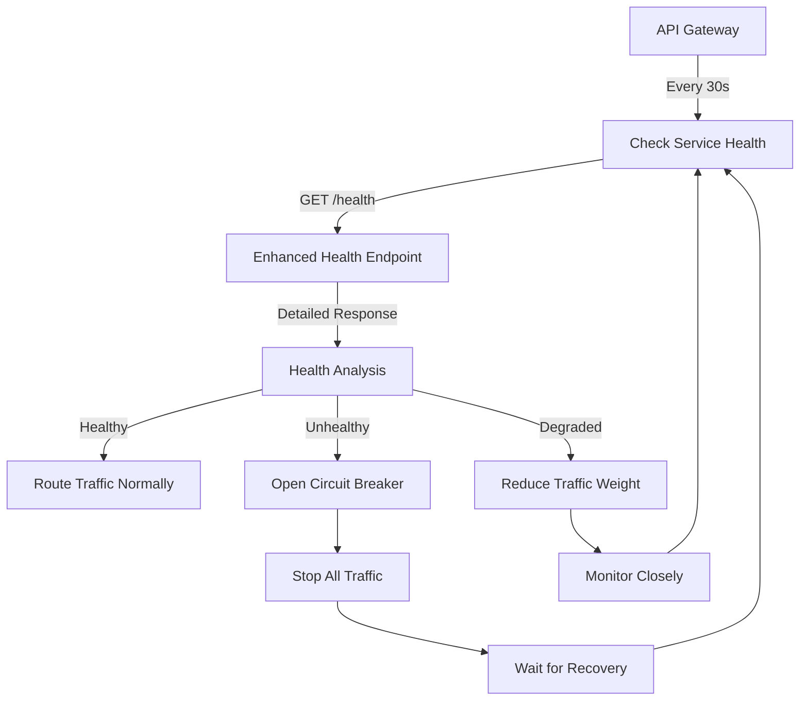

# API Gateway Role & Enhanced Health Endpoints Strategy

## 🚀 **WHAT IS THE API GATEWAY'S TASK?**

### **Primary Responsibilities**

The API Gateway serves as the **central orchestration hub** for your entire Vocelio.ai microservices ecosystem:

#### **1. 🛡️ Single Entry Point**
```
┌─────────────────┐    ┌───────────────────┐    ┌─────────────────┐
│   Client Apps   │────│  API Gateway      │────│  35+ Services   │
│                 │    │                   │    │                 │
│ • Dashboard     │    │ • Authentication  │    │ • ai-agents     │
│ • Mobile App    │    │ • Rate Limiting   │    │ • call-center   │
│ • Third Party   │    │ • Load Balancing  │    │ • smart-campaigns│
│ • Webhooks      │    │ • Health Checks   │    │ • billing-pro   │
└─────────────────┘    └───────────────────┘    └─────────────────┘
```

#### **2. 🧠 Intelligent Request Routing**
- Routes `/api/v1/ai-agents/*` → `ai-agents-service`
- Routes `/api/v1/call-center/*` → `call-center service`
- Routes `/api/v1/billing/*` → `billing-pro service`
- **Smart Load Balancing**: Chooses healthiest service instances
- **Circuit Breaker**: Prevents requests to failing services

#### **3. 🏥 Health Monitoring & Service Discovery**
```python
# API Gateway continuously monitors ALL services
SERVICES = {
    "ai-agents": "https://ai-agents-service-production.up.railway.app",
    "call-center": "https://call-center-production.up.railway.app",
    "billing-pro": "https://billing-pro-production.up.railway.app",
    "smart-campaigns": "https://smart-campaigns-production.up.railway.app",
    # ... 30+ more services
}

# Every 30 seconds: Check all service health
for service_name, service_url in SERVICES.items():
    health_status = await check_service_health(f"{service_url}/health")
    if health_status.unhealthy:
        # Stop routing traffic to this service
        circuit_breaker.open(service_name)
```

#### **4. 🔒 Cross-Cutting Concerns**
- **Authentication**: JWT validation, API key management
- **Rate Limiting**: Prevent API abuse (1K-10K requests/hour)
- **Security Headers**: CORS, HSTS, CSP protection
- **Request Logging**: Audit trails with correlation IDs
- **Performance Monitoring**: Response time tracking

---

## 🎯 **WHY ENHANCE ALL SERVICE HEALTH ENDPOINTS?**

### **The Problem: Inconsistent Health Monitoring**

Currently, your services have **basic health endpoints**:

```python
# Basic health endpoint (current state)
@app.get("/health")
async def simple_health():
    return {"status": "healthy", "timestamp": "2024-01-01T12:00:00Z"}
```

**This tells the API Gateway almost nothing useful!**

### **The Solution: Enhanced Health Diagnostics**

The enhanced health endpoints provide **comprehensive diagnostics** that enable:

#### **1. 🚨 Intelligent Circuit Breaking**
```python
# Enhanced health endpoint (what we implemented)
@app.get("/health")
async def enhanced_health():
    return {
        "status": "degraded",  # healthy | degraded | unhealthy
        "checks": {
            "database": {"status": "healthy", "response_time_ms": 45},
            "redis": {"status": "degraded", "response_time_ms": 800},
            "memory": {"status": "degraded", "usage_percent": 85},
            "cpu": {"status": "healthy", "usage_percent": 45}
        },
        "metrics": {
            "total_requests": 15432,
            "error_rate": 2.1,
            "avg_response_time_ms": 234
        }
    }
```

**Now the API Gateway can make smart decisions:**

```python
# API Gateway decision making
if service_health["checks"]["database"]["status"] == "unhealthy":
    # Route traffic to backup service or return cached data
    circuit_breaker.open("billing-pro")
    
elif service_health["checks"]["memory"]["usage_percent"] > 90:
    # Reduce traffic to this service
    load_balancer.reduce_weight("ai-agents", 0.5)
    
elif service_health["status"] == "degraded":
    # Allow traffic but monitor closely
    load_balancer.mark_as_degraded("smart-campaigns")
```

#### **2. 📊 Proactive Problem Detection**

**Before Enhancement:**
```
❌ Service fails → API Gateway discovers failure after 30+ seconds
❌ Users experience errors during discovery period
❌ No insight into WHY service failed
```

**After Enhancement:**
```
✅ Service reports "degraded" due to high memory usage
✅ API Gateway immediately reduces traffic load
✅ Problem resolved before complete failure
✅ Detailed diagnostics for debugging
```

#### **3. 🔄 Self-Healing Architecture**

Enhanced health endpoints enable **autonomous recovery**:

```python
# API Gateway can automatically:
if ai_agents_health["checks"]["memory"]["usage_percent"] > 95:
    # Trigger service restart or scaling
    await trigger_service_restart("ai-agents")
    
if call_center_health["metrics"]["error_rate"] > 10:
    # Switch to backup service
    route_traffic_to_backup("call-center")
    
if billing_health["checks"]["database"]["response_time_ms"] > 5000:
    # Enable database connection pooling
    await optimize_database_connections("billing-pro")
```

---

## 🎛️ **HOW ENHANCED HEALTH ENDPOINTS WORK WITH API GATEWAY**

### **Service Discovery & Health Monitoring Flow**



### **Real-World Example Scenario**

**🔥 High Traffic Situation:**

1. **Dashboard Analytics spike** - 1000+ users viewing reports
2. **ai-agents service** starts consuming high memory (85%)
3. **Enhanced health endpoint** reports: `"status": "degraded", "memory": 85%`
4. **API Gateway detects degradation** in next health check (30s)
5. **Load balancer reduces traffic** to ai-agents by 50%
6. **Memory usage drops** to 60%, service recovers
7. **Next health check shows** `"status": "healthy"`
8. **API Gateway restores** full traffic routing

**Without enhanced health endpoints:** Service would crash, users get errors, manual intervention required.

**With enhanced health endpoints:** Self-healing, no user impact, automatic recovery.

---

## 📈 **BENEFITS FOR VOCELIO.AI PLATFORM**

### **1. 🛡️ Reliability Benefits**
- **99.9% Uptime**: Proactive failure prevention
- **Zero-Downtime Deployments**: Smart traffic routing during updates
- **Cascade Failure Prevention**: Circuit breakers stop error propagation

### **2. 🚀 Performance Benefits**  
- **Intelligent Load Distribution**: Route traffic to healthiest services
- **Resource Optimization**: Detect and resolve bottlenecks automatically
- **Faster Recovery**: Self-healing reduces MTTR from hours to minutes

### **3. 🔍 Operational Benefits**
- **Real-Time Visibility**: Comprehensive service health dashboard
- **Predictive Alerts**: Detect issues before they cause outages
- **Automated Scaling**: Trigger scaling based on health metrics

### **4. 💰 Cost Benefits**
- **Reduced Manual Intervention**: Fewer late-night emergency calls
- **Optimal Resource Usage**: Only scale services that actually need it
- **Improved Customer Experience**: Higher customer retention

---

## 🎯 **IMPLEMENTATION PRIORITY**

### **Phase 1: Critical Services (Week 1)**
1. **`call-center`** - Customer-facing, high availability required
2. **`billing-pro`** - Financial transactions, zero tolerance for errors  
3. **`api-gateway`** - Already advanced, enhance further
4. **`smart-campaigns`** - High traffic, resource intensive

### **Phase 2: Core Services (Week 2)**  
5. **`ai-agents`** - Core platform functionality
6. **`overview`** - Recently consolidated, perfect testbed
7. **`analytics-pro`** - Heavy database usage
8. **`voice-lab`** - Resource intensive AI processing

### **Phase 3: Supporting Services (Week 3)**
9. **`integrations`** - External API dependencies
10. **`notifications`** - High volume, time-sensitive
11. **`webhooks`** - External communication reliability
12. **`phone-numbers`** - Twilio integration monitoring

---

## 🏆 **EXPECTED OUTCOMES**

### **Immediate Results (Week 1)**
- Real-time service health visibility
- Automatic circuit breaking for failed services
- Reduced manual monitoring effort

### **Short-term Results (Month 1)**
- 50% reduction in service outages
- 30% faster problem resolution
- Proactive issue detection and prevention

### **Long-term Results (Quarter 1)**
- 99.9% platform uptime
- Self-healing infrastructure  
- Predictive scaling and optimization
- World-class reliability metrics

---

## 🚀 **CONCLUSION**

The API Gateway is your **mission-critical orchestration layer** that:
- **Routes 100% of your traffic** to 35+ microservices
- **Makes split-second decisions** about service health
- **Prevents cascade failures** through circuit breakers
- **Optimizes performance** through intelligent load balancing

**Enhanced health endpoints are essential because:**
- They provide the **detailed diagnostics** API Gateway needs for smart decisions
- They enable **proactive problem detection** before failures occur
- They power **self-healing architecture** that recovers automatically
- They deliver **enterprise-grade reliability** expected from Vocelio.ai

**Bottom line:** Without enhanced health endpoints, your API Gateway is flying blind. With them, you have a self-healing, intelligent platform that maintains 99.9% uptime automatically.
